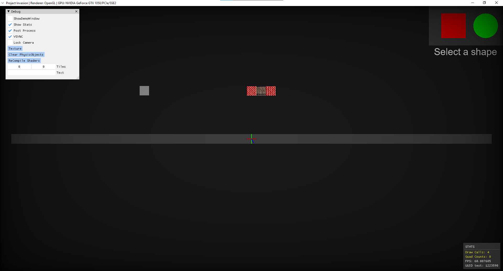

# ProjectInvasion

This a game programming framework with OpenGL for the actual game engine of Vertical Axis.Based on Cherno's game engine Hazel(https://github.com/TheCherno/Hazel).

### Features:

- Drawing flat color quads, textured quads, lines, and circles with batch rendering
- Picking the object on the screen(UI Elements)
- Debug utilities(IMGUI)
- Physics(Box2D)
- Layer System
- Font Rendering (still work in progress)

### Screenshots:

